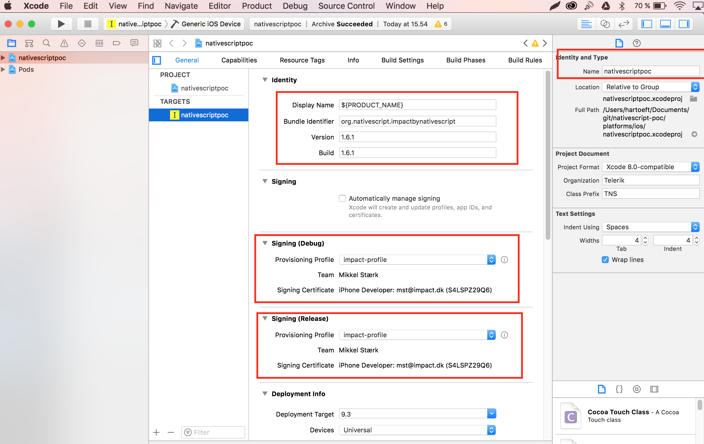
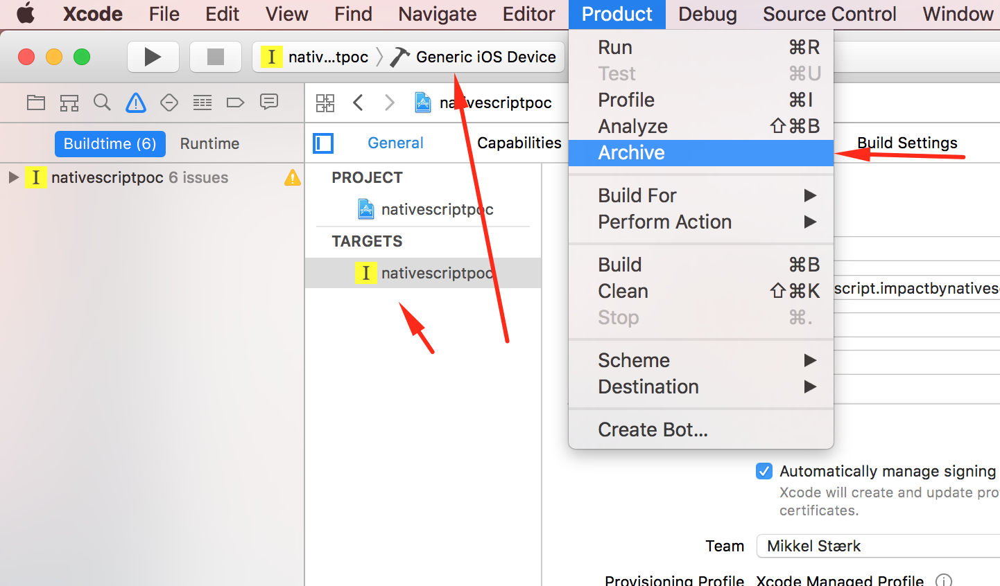
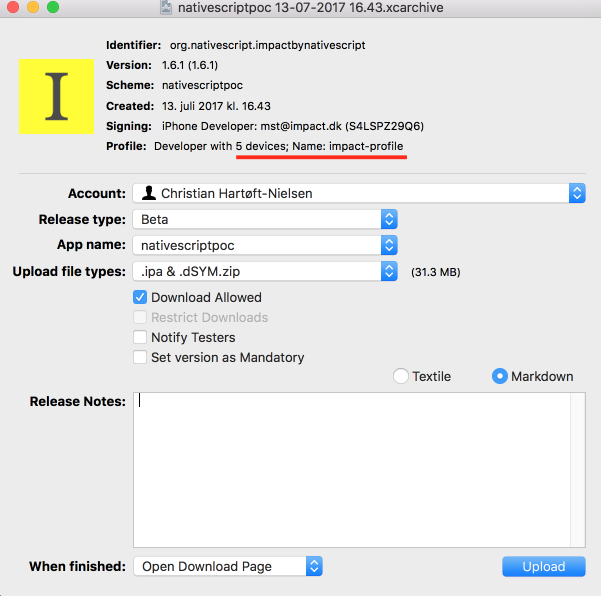
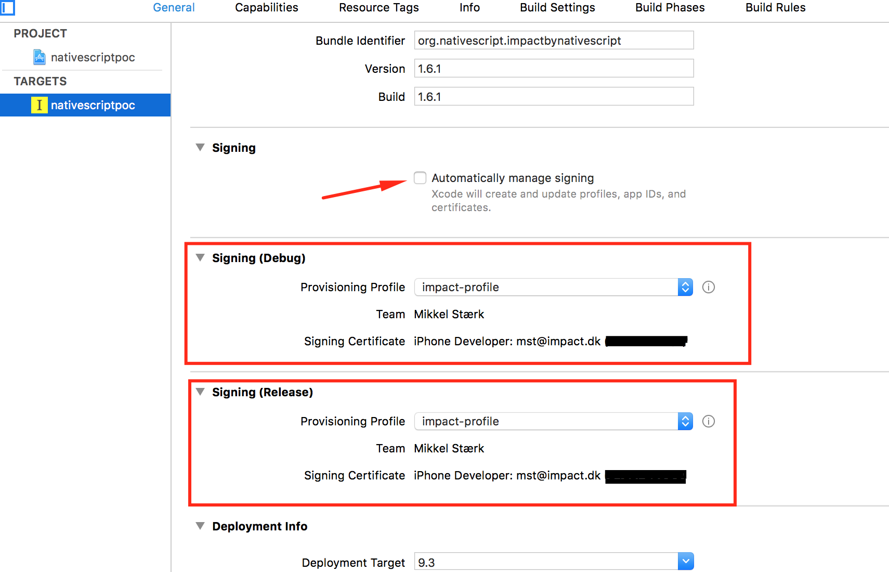

# Nativescript distribution for testing - UNDER DEVELOPMENT
At the moment we are trying out [HockeyApp](https://hockeyapp.net) to distribute Android and IOS apps to users/testers.  
Main reason for using HockeyApp, is that we can manage both Android and iOS apps in one place.

## Content 
* [Programms needed](#programms-needed)
* [Build Nativescript APP](#build-nativescript-app)
* [Upload and build iOS APP](#upload-and-build-ios-app)
* [Add new user/device](#add-user-device)

### Programms needed
* [MacOS] Xcode
* [MacOS] Hockeyapp [Optional] for faster upload  
    - Download link: [https://hockeyapp.net/apps/](https://hockeyapp.net/apps/)
* Nativescript

### Build Nativescript APP
    Change directory to nativescript root project in terminal

1. run: `tns info` if all components is up to date skip next step
-- This also install node_modules, if they werent already

2. run: `tns update`
-- This also install node_modules, if they werent already

3. run: `tns platform add ios`
-- you might run into problems with node-sass, if that happens just install it. npm install node-sass

4. run: `tns doctor` check if components is up to date and check for issues

5. run: `tns device ios --available-devices` chech to if any emulator is installed

6. run: `tns run ios` check if your app can run on emulator

7. run: `tns build ios` or `tns build ios --release` to avoid some warnings in xcode

8. Flollow next guide [Upload and build iOS APP](#upload-and-build-ios-app)

### Upload and build iOS APP
1. open file in __Xcode__: `"project_root/platforms/ios/nativescriptpoc.xcworkspace"`  
Se images for highlighted, fields. Be sure to give the app a name.
And think about what version you are going to deploy.  

2. Build an .ipa file, and upload it to hockeyapp. Product -> Archive
_[optional] Open HockeyApp for Mac, to automatically get notification when it's ready for upload._  

3. Open Hockeyapp and set desired settings 

## Add user device
>__Info:__ We have created a Distribution Group in HockeyApp, for bulk assign users to Apps.

> __Notes:__ Provisioning Profiles:  
    - Development: profiles to use for testing  
    - Distribution: for submission to the App store

1. Open HockeyApp team dashboard: [https://rink.hockeyapp.net/manage/teams](https://rink.hockeyapp.net/manage/teams)

2. Choose the group you want the new user to be assigned to.  
* >_At this moment choose the Group `"Nativescript POC - Testers"`, this group can download both the IOS and Android version of the IMPACT Nativescript POC_  

3. Click `Invite Users` _(email invitation)_

4. New user should open the email invitation on the deivce they want to use and follow instructions.  
* > __IOS:__ _When IOS users register, they automatcally send the device UDID_  
* > __Android:__ _Now android users should be ready to download the app._  

5. In the [Distribution Group](https://rink.hockeyapp.net/manage/teams/103291/team_users) you should be able to click on the new user to get their UDID

6. Go to Apple Developer account  [https://developer.apple.com/account](https://developer.apple.com/account)  
* > At this moment you have to login with MST credentials

7. In menu go to: [Certificates, Identifiers & Profiles](https://developer.apple.com/account/ios/certificate/?teamId=VE3J8X9465) -> Devices -> [your device] (fx. iPhone)

8. Click the + sign to add a new device and giv it a name and paste the UDID number -> continue -> register -> done  
* > Get UDID from Hockeyapp users dashboard.

9. Provisioning Profiles -> Development -> click impact profile -> Edit -> choose newly added device -> generate -> download -> done 

10. Double click downloaded file

11. In Xcode choose setup from image

12. New user is added and will be able to download app after next build.